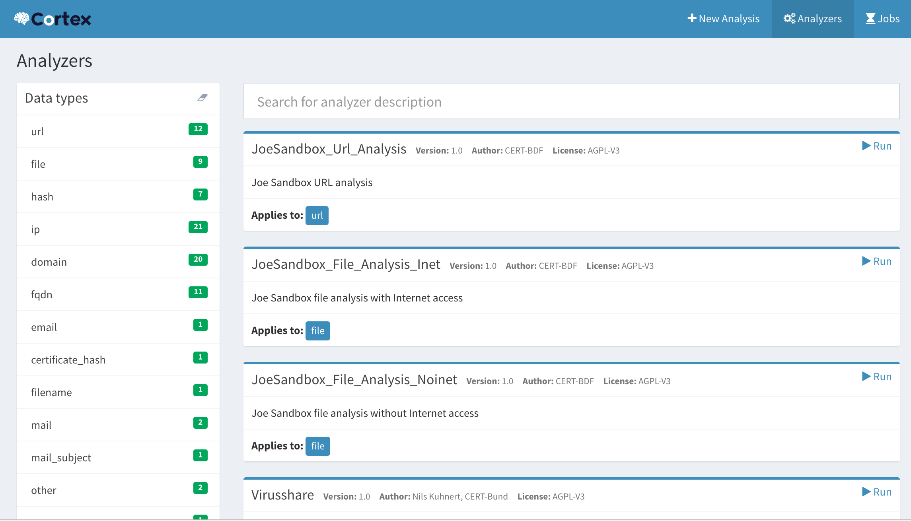
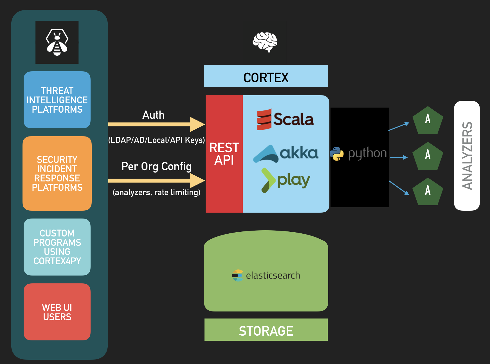

**Cortex** tries to solve a common problem frequently encountered by SOCs, CSIRTs and security researchers in the course of threat intelligence, digital forensics and incident response: how to **analyze observables** they have collected, **at scale**, **by querying a single tool** instead of several?

Cortex, an open source and free software, has been created by [TheHive Project](https://thehive-project.org) for this very purpose. Observables, such as IP and email addresses, URLs, domain names, files or hashes, can be analyzed one by one or in bulk mode using a Web interface. Analysts can also **automate** these operations thanks to the Cortex REST API.

By using Cortex, you won't need to rewrite the wheel every time you'd like to use a service or a tool to analyze an observable and help you investigate the case at hand. Leverage one of the several analyzers it contains and if you are missing a tool or a service, create a suitable program easily and make it available for the whole team (or better, [for the whole community](https://github.com/TheHive-Project/cortex-analyzers/)) thanks to Cortex.

# Cortex and TheHive
Along with [MISP](http://www.misp-project.org/), Cortex is the perfect companion for [TheHive](https://thehive-project.org). TheHive let you analyze tens or hundreds of observables in a few clicks by leveraging one or several Cortex instances depending on your OPSEC needs and performance requirements. Moreover, TheHive comes with a report template engine that allows you to adjust the output of Cortex analyzers to your taste instead of having to create your own JSON parsers for Cortex output.

# Cortex and MISP
Cortex can be integrated with [MISP](http://www.misp-project.org/) in two ways:
- Cortex can [invoke MISP modules](https://github.com/TheHive-Project/CortexDocs/blob/master/misp.md#invoke-misp-modules-within-cortex)
- MISP can [invoke Cortex analyzers](https://github.com/TheHive-Project/CortexDocs/blob/master/misp.md#invoke-cortex-analyzers-within-misp)

# Try it
To try Cortex, you can use the [training VM](https://github.com/TheHive-Project/TheHiveDocs/blob/master/training-material.md) or install it by reading the [Installation Guide](https://github.com/TheHive-Project/CortexDocs/blob/master/installation/install-guide.md).

# Details
## Architecture
Cortex is written in Scala. The front-end uses AngularJS with Bootstrap. Its REST API is stateless which allows it to be horizontally scalable. The provided analyzers are written in Python. Additional analyzers may be written using the same language or any other language supported by Linux.

## Analyzers
Thanks to Cortex, you can analyze different types of observables using tens of analyzers. As of April 14, 2018, there are 39 publicly available analyzers. Most analyzers come in different flavors. For example, using the VirusTotal analyzer, you can submit a file to VT or simply check the latest available report associated with a file or a hash. The full analyzer list, including flavors and requirements, is maintained in the
[Cortex Analyzers Requirements Guide](https://github.com/TheHive-Project/CortexDocs/blob/master/analyzer_requirements.md).

## Documentation
We have made several guides available in the [Documentation repository](https://github.com/TheHive-Project/CortexDocs).

# License
Cortex is an open source and free software released under the [AGPL](https://github.com/TheHive-Project/Cortex/blob/master/LICENSE) (Affero General Public License). We, TheHive Project, are committed to ensure that Cortex will remain a free and open source project on the long-run.

# Updates
Information, news and updates are regularly posted on [TheHive Project Twitter account](https://twitter.com/thehive_project) and on [the blog](https://blog.thehive-project.org/).

# Contributing
We welcome your contributions, **[particularly new analyzers](https://github.com/TheHive-Project/CortexDocs/blob/master/api/how-to-create-an-analyzer.md)**
that can take away the load off overworked fellow analysts. Please feel free 
to fork the code, play with it, make some patches and send us pull requests 
using [issues](https://github.com/TheHive-Project/Cortex/issues).

We do have a [Code of conduct](code_of_conduct.md). Make sure to check it out before contributing.

# Support
Please [open an issue on GitHub](https://github.com/TheHive-Project/Cortex/issues) if you'd like to report a bug or request a feature.

**Important Note**: if you encounter an issue with an analyzer or would like to
request a new one or an improvement to an existing analyzer, please open an
issue on the [analyzers' dedicated GitHub repository](https://github.com/TheHive-Project/cortex-analyzers/issues/new).
If you have problems with TheHive or would like to request a TheHive-related
feature, please [open an issue on its dedicated GitHub repository](https://github.com/TheHive-Project/TheHive/issues/new).

Alternatively, if you need to contact the project team, send an email to <support@thehive-project.org>.

# Community Discussions
We have set up a Google forum at <https://groups.google.com/a/thehive-project.org/d/forum/users>. To request access, you need a Google account. You may create one [using a Gmail address](https://accounts.google.com/SignUp?hl=en) or [without one](https://accounts.google.com/SignUpWithoutGmail?hl=en).

# Website
<https://thehive-project.org/>
