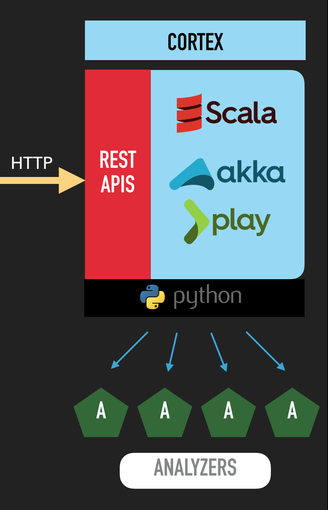

**Cortex** tries to solve a common problem frequently encountered by SOCs, CSIRTs and security researchers in the course of threat intelligence, digital forensics and incident response: how to **analyze observables** they have collected, **at scale**, **by querying a single tool** instead of several?

Cortex, an open source and free software, has been created by [TheHive Project](https://thehive-project.org) for this very purpose. Observables, such as IP and email addresses, URLs, domain names, files or hashes, can be analyzed one by one or in bulk mode using a Web interface. Analysts can also **automate** these operations thanks to the Cortex REST API.

By using Cortex, you won't need to rewrite the wheel every time you'd like to use a service or a tool to analyze an observable and help you investigate the case at hand. Leverage one of the several analyzers it contains and if you are missing a tool or a service, create a suitable program easily and make it available for the whole team (or better, [for the whole community](https://github.com/CERT-BDF/cortex-analyzers/)) thanks to Cortex.

# Cortex and TheHive
Along with [MISP](http://www.misp-project.org/), Cortex is the perfect companion for [TheHive](https://thehive-project.org). Starting from Buckfast (TheHive version 2.10), you can analyze tens or hundreds of observables in a few clicks using one or several Cortex instances depending on your OPSEC needs and security requirements. Moreover, TheHive comes with a report template engine that allows you to adjust the output of Cortex analyzers to your taste instead of having to create your own JSON parsers for Cortex output.

# Architecture
Cortex is written in Scala. The front-end uses AngularJS with Bootstrap. Its REST API is stateless which allows it to be horizontally scalable. The provided analyzers are written in Python. Additional analyzers may be written using the same language or any other language supported by Linux.

  

# Analyzers
There are currently 21 analyzers.

+ Abuse Finder: use CERT-SG's [Abuse Finder](https://github.com/certsocietegenerale/abuse_finder) to find the abuse contact associated with domain names, URLs, IP and email addresses.
+ CIRCLPassiveDNS\*: Check [CIRCL's Passive DNS](https://www.circl.lu/services/passive-dns/) for a given domain.
+ CIRCLPassiveSSL\*: Check [CIRCL's Passive SSL](https://www.circl.lu/services/passive-ssl/) service for a given IP address or certificate hash.
+ DNSDB\*: leverage Farsight's [DNSDB](https://www.dnsdb.info/) for pDNS.
+ DomainTools\*: look up domain names, IP addresses, WHOIS records, etc. using the popular [DomainTools](http://domaintools.com/) service API.
+ File Info: parse files in several formats such as OLE and OpenXML to detect VBA macros, extract their source code, generate useful information on PE, PDF files and much more.
+ GoogleSafeBrowsing: check URLs against [Google Safebrowsing](https://www.google.com/transparencyreport/safebrowsing/).
+ Hippocampe: query threat feeds through [Hippocampe](https://github.com/CERT-BDF/Hippocampe), a FOSS tool that centralizes feeds and allows you to associate a confidence level to each one of them (that can be changed over time) and get a score indicating the data quality.
+ Joe Sandbox\*: analyze URLs and files using the powerful [Joe Sandbox](https://www.joesecurity.org/) malware analysis solution.
+ MaxMind: geolocation.
+ MISP Search\*: search for [MISP](http://www.misp-project.org/) events containing the observable submitted as input.  
+ Nessus: use Tenable's [Nessus Vulnerability Scanner](https://www.tenable.com/products/nessus-vulnerability-scanner) to scan an IP address or a FQDN.
+ Outlook MsgParser: parse Outlook message files automatically and show the key information it contains such as headers, attachments etc.
+ OTXQuery\*: query AlienVault [Open Threat Exchange](https://otx.alienvault.com/) for IPs, domains, URLs, or file hashes.
+ PassiveTotal\*: leverage [RiskIQ's PassiveTotal](https://www.passivetotal.org/) service to gain invaluable insight on observables, identify overlapping infrastructure using Passive DNS, WHOIS, SSL certificates and more.
+ Phishing Initiative\*: query [Phishing Initiative](https://phishing-initiative.fr/contrib/) to assess whether a URL has been flagged a phishing site.
+ PhishTank\*: query [PhishTank](https://www.phishtank.com/) to assess whether a URL has been flagged a phishing site.
+ URLCategory: check the Fortinet categories of URLs.
+ VirusShare: check whether a file/hash is available on [VirusShare.com](https://virusshare.com/).
+ VirusTotal\*: look up files, URLs and hashes through [VirusTotal](https://www.virustotal.com/).
+ Yara: check files against [YARA](https://virustotal.github.io/yara/) rules using yara-python.

The star (\*) indicates that the analyzer needs an API key to work correctly. **We do not provide API keys**. You have to use your own.

# License
Cortex is an open source and free software released under the [AGPL](https://github.com/CERT-BDF/Cortex/blob/master/LICENSE) (Affero General Public License). We, TheHive Project, are committed to ensure that Cortex will remain a free and open source project on the long-run.

# Updates
Information, news and updates are regularly posted on [TheHive Project Twitter account](https://twitter.com/thehive_project) and on [the blog](https://blog.thehive-project.org/).

# Contributing
We welcome your contributions, **[particularly new analyzers](https://github.com/CERT-BDF/cortex-analyzers/)** that can take away the load off overworked fellow analysts. Please feel free to fork the code, play with it, make some patches and send us pull requests.

# Support
Please [open an issue on GitHub](https://github.com/CERT-BDF/Cortex/issues) if you'd like to report a bug or request a feature.

**Important Note**: if you encounter an issue with an analyzer or would like to request a new one or an improvement to an existing analyzer, please open an issue on the [analyzers' dedicated GitHub repository](https://github.com/CERT-BDF/cortex-analyzers/issues/new). If you have problems with TheHive or would like to request a TheHive-related feature, please [open an issue on its dedicated GitHub repository](https://github.com/CERT-BDF/TheHive/issues/new).

Alternatively, if you need to contact the project team, send an email to <support@thehive-project.org>.

# Community Discussions
We have set up a Google forum at <https://groups.google.com/a/thehive-project.org/d/forum/users>. To request access, you need a Google account. You may create one [using a Gmail address](https://accounts.google.com/SignUp?hl=en) or [without one](https://accounts.google.com/SignUpWithoutGmail?hl=en).

# Website
<https://thehive-project.org/>
