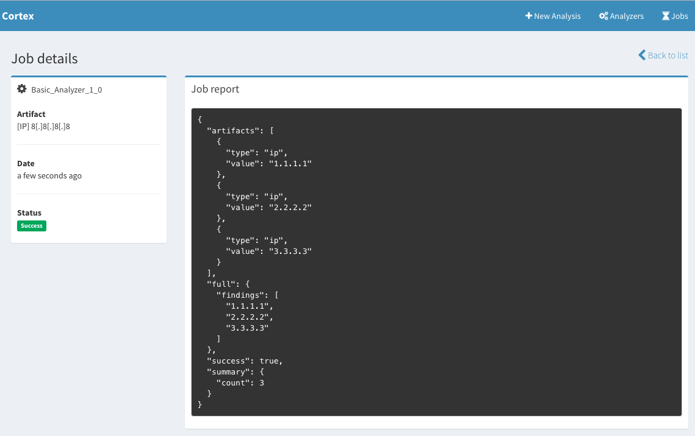
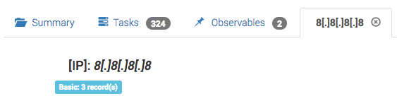
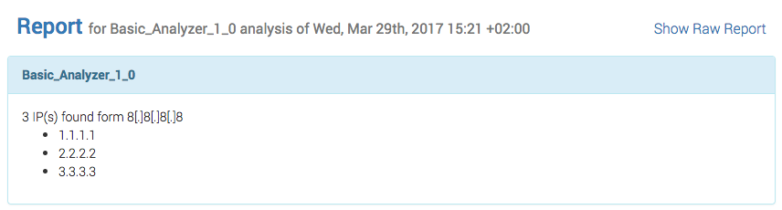

# Overview
The main goal of Cortex is to run analysis on a given observable, defined by its data type, and a value. This observable could be of any type: IP, domain, URL, email, file... 

The programs that Cortex invokes to analyze observables are called **Analyzers**. An **analyzer** could be written in any programming language supported by Linux as long as the resulting program is on the same machine as Cortex and is executable.

# Create a Basic Analyzer
From a technical standpoint, a minimal **analyzer** would be defined by:
- A JSON definition file
- An executable script. As of this writing, all the available analyzers are written in Python. However, analyzers can be written in any programming language supported by Linux

Throughout this document, we will use the [Hippocampe_More](https://github.com/CERT-BDF/Cortex-Analyzers/tree/master/analyzers/Hippocampe) analyzer as an example to teach you how to write your own analyzer.

Our **analyzer** will be defined inside a folder called `Hippocampe`. We use a convention. The folder where the analyzer is located is named after the product or service it leverages to do its work: MISP, MaxMind, PassiveTotal, VirusTotal, DomainTools...

## The JSON Definition File
As its name implies, the JSON definition file contain metadata describing the analyzer. The associated filename must be `<PRODUCT_NAME>_<SERVICE_NAME>.json`. For example: `Hippocampe_more.json` and `Hippocampe_hipposcore.json`.

The structure of this file is described in the table below:

| Attribute  | Type | Description |
| ------------ | ------------- | ------------- |
| name | String, `REQUIRED` | The analyzer's name |
| version | String `REQUIRED` | The analyzer's version |
| description | String `REQUIRED`| The analyzer's description |
| dataTypeList | String[] `REQUIRED` | An array of strings, listing the observable data types that could be analyzed |
| command | String `REQUIRED` | The command to invoke the analyzer's script. It must be relative to the root directory that contain all the analyzer folders |
| baseConfig* | String `OPTIONAL` | The name of the configuration attribute defined in the Cortex configuration file |
| config* | Object `OPTIONAL` | A configuration object that will be passed to the analyzer's command |

**Note**: Fields marked with a star (*) will be described in depth later in this document. 

**Example**
```json
{
    "name": "HippoMore",
    "version": "1.0",
    "description": "Hippocampe detailed report: provides the last detailed report for an IP, domain or a URL",
    "dataTypeList": ["ip", "domain", "fqdn", "url"],
    "baseConfig": "Hippocampe",
    "config": {
        "check_tlp": false,
        "max_tlp":3,
        "service": "more"
    },
    "command": "Hippocampe/hippo.py"
}
```

## The Script
The analyzer script must be an executable script that Cortex runs using the `command` provided within the JSON definition file. The script could be written in any programming language, as long as it could be executed using a shell command.

When running the analyzer's script file, Cortex provides some input data through the standard input, and expects an output through the standard output.

### Analyzer Input
In Cortex, we distinguish between two types of observables: 
- Value-based observables 
- File-based observables

The input sent by Cortex to the analyzers depend on the observable type.

*Note*: when using Cortex with [TheHive](https://github.com/CERT-BDF/TheHive/), we use some output conventions that allow us to normalize the way TheHive displays the analysis reports. 

#### Input for Value-based Observables
The input for value-based observables must have the following structure:

```json
{ 
    "dataType": "ip", 
    "data": "8.8.8.8", 
    "config": {}
}
```

The following table explains the JSON schema of the input:

| Attribute  | Type | Description |
| ------------ | ------------- | ------------- |
| dataType | String, `REQUIRED` | The observables's type |
| data | String `REQUIRED` | The observable's value |
| config* | Object `OPTIONAL` | A config object, representing the analyzer's options and parameters if any |


#### Input for File-based Observables
The input for file-based observables must have the following structure:
```json
{ 
    "dataType": "file", 
    "attachment": {
        "name": "<file.extension>"
    },
    "file": "/path/to/file/observable",
    "config": {}
}
```

The following table explains the JSON schema of the input:

| Attribute  | Type | Description |
| ------------ | ------------- | ------------- |
| dataType | String, `REQUIRED` | The observable's type (`file` in this case) |
| file | String `REQUIRED` | The observable's file path |
| attachment.name | String `OPTIONAL` | The observable's file name |
| config* | Object `OPTIONAL` | A config object, representing the analyzer's options and parameters if any |

#### The Analyzer Configuration Object
An analyzer can define a default configuration object in its JSON definition file. Cortex can override or add additional configuration properties using the Cortex's configuration file.

Based on that, the `config` object passed to the analyzer's script results from the merge operation of three objects:
- the `config` object defined in the analyzer's JSON definition file (defines the default values of the analyzer's config) 
- the `baseConfig` object defined in the Cortex's configuration file using the `analyzer.config.<baseConfig>` property (used to hold sensitive properties like API keys or credentials)
- the *global* analyzers configuration defined in the Cortex's configuration file using `analyzer.config.global` (generally contains proxy configuration information)


### Analyzer Output
The output from Cortex could technically be any JSON object. That said, Cortex's UI might rely on a specific attribute to decide if the job failed or succeeded. The property is named `success` and must be a Boolean value.

In the existing analyzers we tried to stick to some conventions where we defined the formats defined below.

#### Successful Analysis
```json
{
    "success": true,
    "summary": {},
    "artifacts": [],
    "full": {}
}
```

The following table explains the JSON conventions of the output:

| Attribute  | Type | Description |
| ------------ | ------------- | ------------- |
| success | Boolean `REQUIRED` | The analysis success flag |
| summary | Object `OPTIONAL` | The analysis summary: a small report |
| full | Object `REQUIRED` | The analysis complete report |
| artifacts | Array[`<Artifact>`] `OPTIONAL` | An array of artifacts discovered by the analyzer |

The `<Artifact>` object has the following structure:

| Attribute  | Type | Description |
| ------------ | ------------- | ------------- |
| type | String `REQUIRED` | The artifact data type |
| value | String `REQUIRED` | The artifact value |

**Note**: the `artifacts` array will be used in the future by [TheHive](https://github.com/CERT-BDF/TheHive/) to display or import the extracted artifacts from an analysis report.

#### Unsuccessful Analysis
```json
{
    "success": false,
    "errorMessage": ""
}
```

# The Cortexutils Library
`cortexutils` is a Python library available on `pip`. It provides a Python class that facilitates the creation of analyzer script files. It includes an abstract `Analyzer` class that a programmer may inherit and override in their script. It also provides some methods to quickly format the output to be compliant with the JSON schema expected by [TheHive](https://github.com/CERT-BDF/TheHive/).

To create an analyzer class, developers have to:

1. Create a subclass of `cortexutils.analyzer.Analyzer`
2. Override the constructor, call the super constructor and if needed, read the specific analyzer's options (read specific configuration properties from the config object)
3. Override the `run` method. It must either return a report, using the `report` method, or an error using the `error`method. If `run`is not overridden, the analyzer returns an empty report
3. Optionally override the `summary` method. It should return a JSON object representing a summary of the analyzer report. If not overridden, the analyzer returns an empty summary
3. Optionally override the `artifacts` method. It should return a JSON array representing a list of `artifact` objects (as described above). If not overridden, the analyzer returns the result of an `ioc-parser`, ran over the full JSON report.

Below is an example of a basic analyzer that can handle IPs and domains:

```python
#!/usr/bin/env python
# encoding: utf-8

from cortexutils.analyzer import Analyzer

# Define analyzer's class
class BasicExampleAnalyzer(Analyzer):
    # Analyzer's constructor
    def __init__(self):
        # Call the constructor of the super class
        Analyzer.__init__(self)

        # Read specific config options
        self.optional_prop = self.getParam('config.optional_prop', '')
        self.required_prop = self.getParam('config.required_prop', None, 'Error: Missing required_prop')

    # Override the report method. This is the analyzer's entry point
    def run(self):
        # Put your analyzer's logic here
        result = {}

        # This is just an example
        if self.data_type == 'ip':
            result['findings'] = ['1.1.1.1', '2.2.2.2', '3.3.3.3']
        elif self.data_type == 'domain':
            result['findings'] = ['domain1.com', 'domain2.com', 'domain3.com']
        else:
            return self.error('Unsupported observable data type')

        # Return the report
        return self.report(result)

    # Override the summary method
    def summary(self, raw_report):
        return {
            'count': len(raw_report['findings'])
        }

    # Override the artifacts method
    def artifacts(self, raw_report):
        result = []
        if 'findings' in raw_report:            
            for item in raw_report['findings']:
                result.append({'type': self.data_type, 'value': item})            

        return result
    
# Invoke the analyzer
if __name__ == '__main__':
    BasicExampleAnalyzer().run()

```

To call this analyzer, we can run the following command:

```
python sample-analyzer.py <<< '{
    "dataType":"ip", 
    "data": "8.8.8.8", 
    "config":{
        "required_prop": "anyvalue"
    }
}'
```

This will generate the following output:

```json
{
   "success" : true,
   "artifacts" : [
      {
         "value" : "1.1.1.1",
         "type" : "ip"
      },
      {
         "value" : "2.2.2.2",
         "type" : "ip"
      },
      {
         "value" : "3.3.3.3",
         "type" : "ip"
      }
   ],
   "summary" : {
      "count" : 3
   },
   "full" : {
      "findings" : [
         "1.1.1.1",
         "2.2.2.2",
         "3.3.3.3"
      ]
   }
}
```

And in Cortex 

# TheHive and Cortex analyzers
Using Cortex from an instance of [TheHive](https://github.com/CERT-BDF/TheHive/) helps the users improve the analysis report visualization. In fact, TheHive uses the outputs generated from Cortex analyzers in two ways:

- Store the `summary` content as part of the observable's data. This is available for successful analysis jobs only.
- Display the `full`report using the report templates defined within TheHive.

## Report templates
[TheHive](https://github.com/CERT-BDF/TheHive/) is based on Angular 1 and report templates have to be Angular templates which we try to fill using the job's report data. 

We distinguish 2 types of report templates:

### Short reports
Generates what we call **mini reports**, to be displayed in the observable's details page and observables list. Short report templates receive the following data:

| Attribute  | Type | Description |
| ------------ | ------------- | ------------- |
| name | String | Analyzer's ID |
| content | Object | The job report's `summary` object |
| artifact | Object | The observable details, as stored in TheHive |

For example, if we want to create a short report template for the `BasicExampleAnalyzer`, we could write the following HTML short report file:

```html
<span class="label label-info">Basic: {{content.count || 0}} record(s)</span>
```

`content` being the following:

```json
{
    "count" : 3
}
```

The result in TheHive will be 

### Long reports
Like short reports, the long reports are used to render the content of the `full` attribute of a job JSON report.

Long report templates receive the following data:

| Attribute  | Type | Description |
| ------------ | ------------- | ------------- |
| name | String | Analyzer's ID |
| status | String | The job's status: `Success`, `Failure`, `InProgress` |
| success | Boolean | The job's success status |
| content | Object | The job report's `full` object |
| artifact | Object | The observable details, as stored in TheHive |


For example, if we want to create a long report template for the `BasicExampleAnalyzer`, we could write the following HTML long report file:

```html
<!-- Success case -->
<div class="panel panel-info" ng-if="success">
    <div class="panel-heading">
        <strong>{{name}}</strong>
    </div>
    <div class="panel-body">
      <div>{{content.findings.length}} {{artifact.dataType | uppercase}}(s) found form {{artifact.data | fang}}</div>
      <ul>
          <li ng-repeat="finding in content.findings">{{finding}}</li>
      </ul>
    </div>
</div>

<!-- Failure case -->
<div class="panel panel-danger" ng-if="!success">
    <div class="panel-heading">
        <strong>{{artifact.data | fang}}</strong>
    </div>
    <div class="panel-body">
        {{content.errorMessage}}
    </div>
</div>
```

`content` being the following:

```json
{
    "findings" : [
        "1.1.1.1",
        "2.2.2.2",
        "3.3.3.3"
    ]
}
```

The result in TheHive will be 